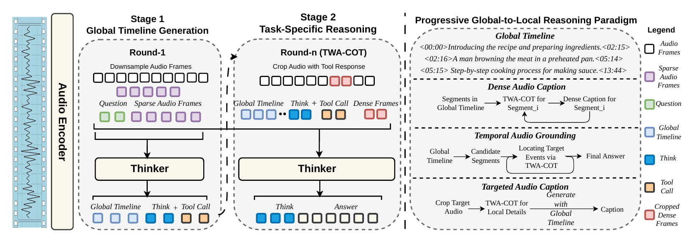
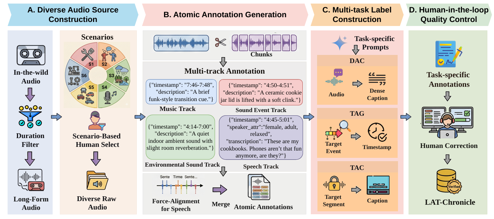

# Listening with Time: Precise Temporal Awareness for Long-Form Audio Understanding


<p align="center">
  Mingchen Shao<sup>1</sup>, 
  Hang Su<sup>2</sup>, 
  Wenjie Tian<sup>1</sup>, 
  Bingshen Mu<sup>1</sup>, 
  Zhennan Lin<sup>1</sup>, 
  Lichun Fan<sup>2</sup>, 
  Zhenbo Luo<sup>2</sup>, 
  Jian Luan<sup>2</sup>, 
  Lei Xie<sup>1</sup><sup>†</sup>, 
</p>

<p align="center">
  <sup>1</sup> Audio, Speech and Language Processing Group (ASLP@NPU), Northwestern Polytechnical University <br>
  <sup>2</sup> Independent Researcher <br>
</p>

<!-- 📑 <a href="https://arxiv.org/abs/2601.11027">Paper</a> &nbsp&nbsp | &nbsp&nbsp  -->
<p align="center">
🐙 <a href="https://github.com/alanshaoTT/LAT-Audio-Repo">GitHub</a> &nbsp&nbsp | &nbsp&nbsp 
🤗 <a href="https://huggingface.co/collections/mcshao/lat-audio">HuggingFace</a> &nbsp&nbsp | &nbsp&nbsp 
<!-- 🖥️ <a href="">HuggingFace Space</a> &nbsp&nbsp | &nbsp&nbsp  -->
💬 <a href="https://github.com/alanshaoTT/LAT-Audio-Repo?tab=readme-ov-file#contact">Contact Us</a>
</p>

## 🚀 Overview

Large Audio Language Models (LALMs) perform well on short audio but struggle with long-form audio due to **temporal hallucination** and **timestamp drift**.

We propose **LAT-Audio**, a global-to-local reasoning framework that enables precise temporal awareness through:
- A **global timeline** for structured temporal understanding
- A **Think-With-Audio Chain-of-Thought (TWA-CoT)** for iterative reasoning
- A **tool-augmented mechanism** to retrieve local audio evidence

We further introduce:
- **LAT-Chronicle**: a 1.2k-hour long-form audio dataset
- **LAT-Bench**: the first human-verified long-form temporal benchmark

## 🧠 Framework

<p align="center">
  

</p>

LAT-Audio follows a **progressive global-to-local reasoning paradigm**:
1. Construct a global timeline as temporal-semantic anchors
2. Perform multi-step reasoning via TWA-CoT
3. Iteratively retrieve audio evidence through tool calls

## 📊 Dataset & Benchmark

<p align="center">
  

</p>

| Component | Description |
|----------|------------|
| **LAT-Chronicle** | A 1.2k-hour long-form audio dataset (1k Chinese / 200h English) with fine-grained temporal annotations across six real-world scenarios. |
| **LAT-Bench** | A human-verified benchmark for long-form temporal reasoning, covering three core tasks: Dense Audio Captioning (DAC), Temporal Audio Grounding (TAG), and Targeted Audio Captioning (TAC). |

**LAT-Chronicle** is constructed via a human-in-the-loop pipeline with multi-track atomic annotations (speech, sound events, music, and environment), enabling precise temporal supervision for long-form audio understanding.

**LAT-Bench** supports audio up to **30 minutes**, providing realistic evaluation settings. All annotations are carefully validated to ensure high temporal accuracy and consistency, covering diverse scenarios such as conversations, vlogs, and complex acoustic environments.


👉 Download:
- 🤗 LAT-Chronicle: [LAT-Chronicle](https://huggingface.co/datasets/mcshao/LAT-Chronicle).
- 🤗 LAT-Bench: [LAT-Bench](https://huggingface.co/datasets/mcshao/LAT-Bench).

## 🤖 Models

| Model | Reasoning | Training Data | Description |
|------|----------|--------------|-------------|
| **LAT-Audio** |  Yes | LAT-Chronicle | Tool-augmented multi-step reasoning model with global-to-local temporal inference |
| **LAT-Audio-Base** |  No | LAT-Chronicle + in-house | Direct modeling baseline fine-tuned from Qwen3-Omni with more in-house data, offering faster and simpler inference |

👉 Download:
- 🤗 LAT-Audio: [LAT-Audio](https://huggingface.co/mcshao/LAT-Audio).
- 🤗 LAT-Audio-Base: [LAT-Audio-Base](https://huggingface.co/mcshao/LAT-Audio-Base).

## 🛠️ Quick Start

### Environment Setup

```
conda create -n lat-audio python=3.10 -y
conda activate lat-audio
pip install -r requirements.txt
```

### Usage

#### Inference

LAT-Audio
```
cd examples/train/multimodal/
python lat-audio-infer.py \
  --ckpt ./checkpoints/LAT-Audio \
  --task TAG_EN \
  --test_file ./data/TAG_test_EN.jsonl \
  --crop_dir ./tmp_crops \
  --output ./results/TAG_EN.jsonl
```

LAT-Audio-Base
```
cd examples/train/multimodal/
bash lat-audio-base-infer.sh
```

#### Evaluation Protocol

Dense audio caption
```
cd examples/train/multimodal/
python ./eval/evaluate_dac.py \
  --input ./result/DAC/EN.jsonl \
  --output ./reports/dac_en_metrics.json \
  --pred-field response \
  --ref-field labels \
  --thresholds 0.3,0.5,0.7 \
  --device cuda \
  --sbert-model ./paraphrase-multilingual-MiniLM-L12-v2
```

Target audio caption
```

```

## 📜 Citation

```bibtex
@article{shao2026lataudio,
  title={Listening with Time...},
  ...
}
```

## Contact

If you are interested in leaving a message to our research team, feel free to email mcshao@mail.nwpu.edu.cn .
